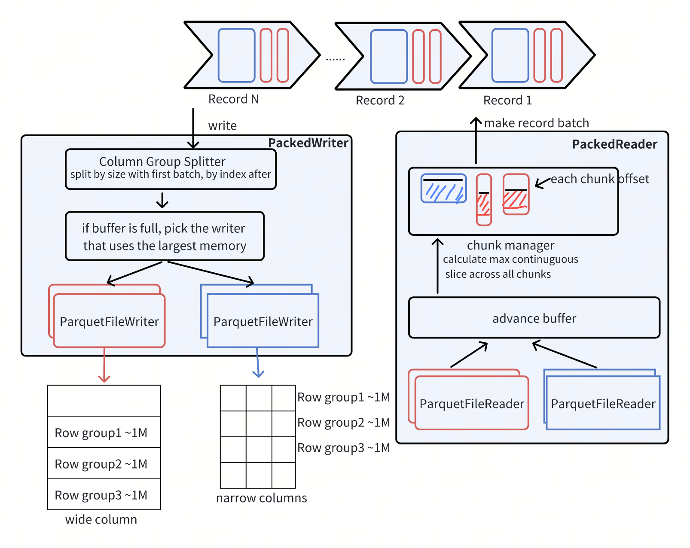

# Design

Packed storage is Milvus storage engine that uses Apache Arrow Parquet as the underlying data format. It is designed to optimize read and write performance by packing narrow columns into groups. There are three main advantages of packed storage:

1. Read and write memory can be controlled separately.
2. Reduce the number of storage files.
3. Support partial reading capability.



## Packed Writer
The PackedWriter serves as the primary interface for the write path. Initialization requires specifying memory limit, table schema, file system source, write path, and Parquet writer properties.

During writing, half of the allocated memory is used as the first buffer for dividing columns into groups, initializing columnGroupWriter, and validating memory usage:

1. Column Group: When the buffer is full, sizedBasedSplitter divides columns into groups based on their sizes, recording the original column indices. Subsequent writes use indexBasedSplitter to divide columns by these indices.
2. Initialize ColumnGroupWriter: After grouping, each group is assigned a ColumnGroupWriter, which wraps the Arrow file writer. Since the Arrow writer divides row groups based on row count (by default 1024 * 1024 rows) rather than size, the ColumnGroupWriter ensures that row groups are written based on size.
3. Memory Validation and Calculation: S3 uploads use multipart uploads with part size requirements. For example, AWS S3 requires a minimum part size of 5MB. In Arrow, the part size is set to 10MB due to Cloudflare R2 constraints. Therefore, the minimum memory required is `column_group_num * (row_group_size + 10MB)`, and the maximum is `column_group_num * 20MB`.
The subsequent memory buffer is constrained by the above calculation. For each incoming batch, if the total buffer exceeds the memory limit, the largest ColumnGroupWriter in the maxHeap will be flushed. Once space is available, the batch is split by IndexBasedSplitter and written to the corresponding columnGroupWriter.

## Packed Reader
The PackedReader is mainly responsible for reading and deserializing data from multiple Parquet files into recordBatch. Initialization requires providing the file system, file paths, schema, file and column positions for each column, the required columns, and a memory limit. PackedReader consists of two main parts: advanceBuffer and chunk manager.

1. AdvanceBuffer: This component manages buffer size and reads as many row groups as possible from the file while updating memory usage. The reading logic involves extracting the smallest row offset from a minHeap as long as there is enough memory. It probes the next row group in the file and records the readable row group index. When memory is close to full, ParquetFileReader calls `ReadRowGroups(const std::vector<int>& row_groups, std::shared_ptr<::arrow::Table>* out)` to perform an I/O read for each file.

2. ChunkManager: A chunk represents a contiguous memory unit in Parquet. To achieve zero-copy processing, chunk manager handles data read by advanceBuffer. It splits data into chunks based on the largest contiguous fragment size from multiple Arrow table queues, considering the offset of each column group. Depending on the chunk size and the current block's length and offset, it determines whether to read the current block entirely or move to the next. If all chunks are fully read, the table is marked for deletion to free memory. In extreme cases, offset differences might require a file to span multiple tables, so each file maintains a queue to track its records.

3. ReadNext: This method checks if new data needs to be read. If so, it calls advanceBuffer and then uses chunkManager to determine the largest contiguous data block, deserializing the data and returning it as a recordBatch.

## Cloud Storage Support
We have validate with the following cloud object stroage services, please see `cpp/test/packed/packed_integration_test.cpp` for how to integrate packed reader and writer with these services:
1. AWS S3
2. Google Cloud Storage
3. Aliyun OSS
4. Tencent COS

# Developement Guide

This document is a guide for developers who want to contribute to Milvus Storage. It provides information on the development environment, coding style, and testing process.

## Development Environment

### Prerequisites

- conan >= 1.54.0
- Docker 19.03+
- Docker Compose 1.25+
- Git


### Setup

To set up the development environment, follow these steps:

1. Clone the repository:

```    
git clone https://github.com/milvus-io/milvus-stroage.git
```

2. Build the Milvus Docker image:

```
cd milvus-storage/cpp
docker build -t milvus-storage:latest .
```

3. Start the Docker container:

```
docker run -it milvus-storage:latest bash
```

### Building
```
make build
```

### Testing
```
make test
```

This will run all the tests in the `test` directory.

### Code Style

```
make fix-format
```

This will format the code using `clang-format` and fix any style issues.
