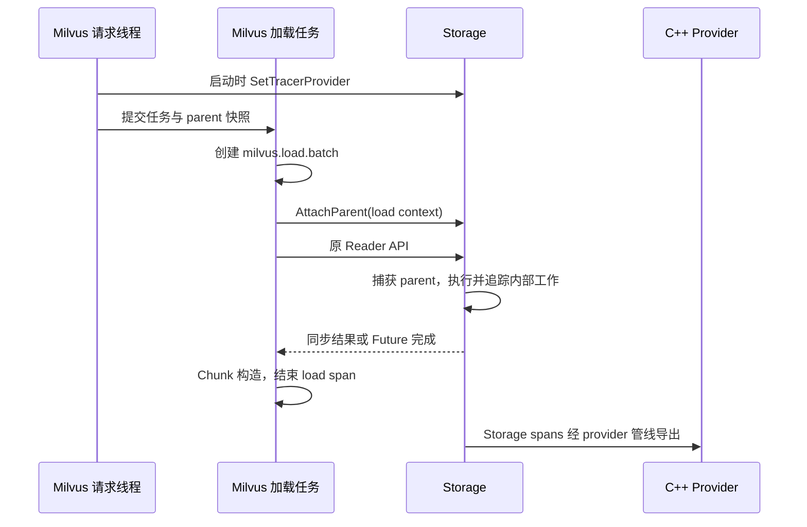

# Milvus 接入 Storage OpenTelemetry 设计

## 1. 状态与范围

状态：设计提案，尚未实现或完成运行验证。本文描述 **Milvus repo** 的改造；Storage 的实现见 [Milvus Storage 设计](opentelemetry-storage-design.md)。两份文档暂存于 Storage repo，本文的模块路径除特别说明外均相对 Milvus repo。

核对基线：

- Milvus：`5963da22e8156ad275bb6d1431aeeaa0cfb2c70a`。
- Storage：`43b7793406136208928ad20dc1596b510c7b629a`。
- Milvus 的 `internal/core/thirdparty/milvus-storage/CMakeLists.txt` 当前固定引用 Storage `3ae6ac4`。不能将独立 Storage checkout 的能力视为 Milvus 已接入；落地时需升级依赖并联调。

目标：将查询及其他读取操作触发的 Storage 工作关联到调用方 trace，区分 Milvus 调度、缓存等待、Storage 读取和 Milvus 数据转换；保持 Storage 既有 Reader 方法参数不变，支持线程池和 Folly fiber。Go packed FFI 路径通过兼容扩展补充上下文。

不在本次范围：改变查询算法、读取调度与取消语义，修改元数据/持久化格式，默认采集每行/每页 spans，追踪远端 Talon 服务内部执行。后者需要独立的远程协议传播设计。

## 2. 概念与职责

| 概念 | 含义 | 本方案决策 |
|---|---|---|
| TracerProvider | 获取 Tracer；SDK 实现关联采样、资源与 SpanProcessor/Exporter | Milvus 配置 C++ provider，并显式注入 Storage |
| Instrumentation scope | 埋点来源的名称与版本；不是请求上下文 | Storage 使用 `milvus-storage` 与自身构建版本 |
| Parent context | trace ID、父 span ID、flags、tracestate 等 | 决定子 span 属于哪个 trace；按操作传递 |
| Active scope | 在执行上下文中临时激活 parent，退出后恢复 | Storage `AttachParent` 使用 Folly RequestContext |
| Span 生命周期 | 从操作开始到实际完成 | 与 active scope 生命周期分离 |

共享 provider 不会自动关联 trace，必须传递 parent。Go 与 C++ 仍使用各自 SDK 实例；这里共享的是 Milvus C++ 与 Storage C++ provider。Storage 保留宿主 provider 的 Resource，例如 `service.name`，通过 instrumentation scope 区分埋点来源。

## 3. 当前调用路径与缺口

```text
Go context
  → internal/util/segcore/trace.go：ParseCTraceContext
  → internal/core/src/segcore/segment_c.cpp：SegCoreSearch
  → 算子 / CacheSlot / Translator
  → segcore/memory_planner.cpp：LoadCellBatchAsync
  → Milvus 加载线程池
  → MakeChunkReaderFactory
  → ChunkReader::get_chunks(indices, parallelism=1)
  → Storage 格式层 / 文件系统
```

基线中的主加载路径调用同步 `get_chunks`，不是 Storage 的新 async 方法。`LoadCellBatchAsync` 已接收 `OpContext*`，但提交给 worker 的闭包没有显式建立 Storage parent context。

Milvus 的 `GetRootSpan()` 属于自身 tracer 的 TLS 机制，不等价于 OTel current span，也不能跨线程或 fiber 自动传播。已有 `OpContext` 可作为父信息来源，但不得跨 worker 共享修改其 current-span 槽位。

另一条路径为 `internal/storagev2/packed/packed_reader_ffi.go` → Milvus C++ FFI → Storage → ArrowArrayStream。`ReadNext()` 通过导入的 Arrow record reader 读取，没有请求 context 输入；必须单独适配，不能假设能继承 Segcore 上下文。

## 4. 跨 repo 契约

契约版本：**v1 提案**。接口由 Storage repo 定义和实现，权威语义见 [Storage 设计第 3 节](opentelemetry-storage-design.md#3-公共边界契约v1)。以下为接口草图，不是现有可调用 API。

```cpp
namespace milvus_storage::tracing {
struct TraceParent;  // 拥有 trace_id/span_id/flags/tracestate/is_remote
class TraceScope;   // 不可复制/移动，析构恢复上下文
using ProviderPtr = opentelemetry::nostd::shared_ptr<
    opentelemetry::trace::TracerProvider>;

void SetTracerProvider(ProviderPtr provider);
[[nodiscard]] TraceScope AttachParent(const TraceParent& parent);
}
```

| 接口/边界 | Milvus 责任 | Storage 责任 |
|---|---|---|
| `SetTracerProvider` | 初始化、更新后传入有效 provider；禁用时传空；管理 shutdown | 持有引用，发布新 provider 快照，不覆盖宿主全局状态 |
| `AttachParent` | 在实际 Storage 调用处传入拥有数据的 parent | 为当前执行上下文建立临时父上下文；退出恢复 |
| 原 Reader API | 保持调用参数；提供调用期间的 active parent | API 入口捕获 parent；管理内部所有后续工作 |
| Go → Milvus C++ | 序列化、复制 Go SpanContext，建立请求专属调用边界 | 不识别 Go 或 Milvus 私有类型 |
| Storage C++ ↔ Rust | 无责任 | 自行适配 Tokio、blocking pool、FFI 回调 |

Milvus 不向 Storage 传 `OpContext*`、Go 指针或取消令牌。parent 快照的字符串和 ID 必须拥有自身数据；同进程 C++ parent 标记 local。保留上游已有 tracestate，当前 CGO 未传入的 tracestate 不凭空补齐；需要完整保留时使用新增兼容入口。

Provider 指针仅用于 ABI 匹配的 C++ 集成，不穿过 C ABI 或 Rust。Milvus 构建需统一 OTel ABI namespace、版本与相关编译选项。单纯属于不同 repo 并不消除同进程 C++ ABI 约束。

## 5. Milvus 模块改造

### 5.1 初始化、更新与关闭

入口为 `internal/core/src/common/init_c.cpp` 的 `InitTrace`、`SetTrace` 及相应宿主生命周期管理路径。

1. 完成已有 C++ telemetry 初始化后，取得当前 provider，调用 Storage `SetTracerProvider`。
2. 配置更新时，在新 provider 准备就绪后发布；不要只更新 Milvus 全局 provider 而遗留 Storage 旧引用。
3. 禁用 tracing 时向 Storage 传空。已有读取继续使用创建时的 provider 快照，不强行结束 spans。
4. 关闭时先停止新操作，等待受管理的在途工作结束，再 flush/shutdown provider。替换 provider 时也需保留旧实例直到其在途 spans 完成；引用计数存活不等于尚未调用 shutdown。

独立 repo 交互集中在 Milvus 的 Storage tracing adapter。无需为了调用 Storage 修改 `milvus-common` 的 API；若现有生命周期能力不足，作为单独依赖项列出，不能隐含要求第三个 repo 同步改造。

### 5.2 Parent 提取与任务提交

在提交加载任务前提取并复制 parent，来源优先级：调用点明确持有的 span → `OpContext` 显式 trace span/context → 无 parent。仅在已确认普通线程且 TLS 与当前请求绑定的路径，允许用现有 root span 做边界转换；不在 worker 中根据残留 TLS 猜测 parent。

主落点：

- `internal/core/src/segcore/storagev2translator/ManifestGroupTranslator.cpp`。
- `internal/core/src/segcore/storagev2translator/GroupChunkTranslator.cpp`。
- `internal/core/src/segcore/memory_planner.cpp` 的 `LoadCellBatchAsync`。
- Reader 构造、metadata 获取和直接 take/scan 调用点，按调用清单补齐，不能只覆盖 factory 内部数据读取。

交互伪代码：

```cpp
auto parent = SnapshotParent(op_context);  // Milvus adapter，提交前复制
pool.Submit([parent, reader, indices] {
    auto load = StartMilvusLoadSpan(parent);  // 异常路径也结束
    {
        auto guard = storage_tracing::AttachParent(SnapshotParent(load));
        auto result = reader->get_chunks(indices, 1);
        RecordResult(load, result);
    }
    EndMilvusLoadSpan(load);
});
```

真实实现需用完成保护处理异常、提前返回及提交失败。不得为 tracing 捕获可能提前析构的 `OpContext*`；已有取消指针的有效性仍遵循原业务契约。

### 5.3 Async 与 fiber

返回 Future 的调用必须在 `AttachParent` scope 内发起。随后 scope 可结束，Storage 已捕获 parent。Milvus 的 load span 由自己的异步完成状态持有，到结果真正完成时结束。

Folly fiber 中 `AttachParent` 可以跨该运行时管理的挂起/恢复，因为其底层是 RequestContext，而非普通 OTel TLS。Milvus 自己的新 load span 也使用显式 parent 和操作状态，不能在 fiber 中持续保留旧 `SetRootSpan` TLS guard。

Milvus 负责到 Storage API 入口为止的传播：自定义线程池必须显式捕获并恢复；不可假定任意 `Submit`、fiber 框架都具有 Folly 的语义。Storage 负责入口之后的线程池、Arrow、CRT、Tokio 边界。

### 5.4 Go packed FFI

新增兼容的 `ReadNextWithContext(ctx)` 路径，旧 `ReadNext()` 保留。新路径通过 Milvus C++ shim 在**一次 CGO 调用**中接收 parent、建立 Storage scope、调用 Arrow stream `get_next`、恢复 scope。C++ 复制所有会异步使用的 parent 数据。

这涉及 Milvus 对 ArrowArrayStream/record reader 的适配，不是给当前 Go `recordReader.Read()` 前面增加一次 set-TLS 调用。必须保留 Arrow schema/array/stream 所有权和 release 语义，并为 open/metadata 路径提供相应带 context 的兼容入口。

若保留现有 Arrow 导入流程，允许改用请求专属 stream wrapper：构造时接收 parent，每次 `get_next` 激活它。仅适用于 stream 从创建到释放均属于一个请求的场景；跨请求复用必须采用逐次 context 入口。不得将 parent 写入共享底层 Reader。实施时选择一种路径并完成所有权验证，不能默认两者等价。

### 5.5 Milvus 自身 spans

| Span | 起止与含义 |
|---|---|
| `milvus.cache.lookup` | 查询缓存及命中结果 |
| `milvus.cache.wait` | 等待共享加载，不伪造本请求物理 I/O |
| `milvus.load.admission_wait` | 等待内存预算/加载许可 |
| `milvus.load.queue_wait` | 入队到 worker 开始执行 |
| `milvus.load.batch` | worker 执行到本批处理完成 |
| `milvus.chunk.build` | Storage 返回 Arrow 数据后构造 Chunk、拷贝、mmap 写入 |

后台预热、加载、compaction 使用自身宿主操作 trace，不挂到无关查询。cache hit 未进入 Storage 时，没有 Storage I/O span 是正确结果。共享加载只发生一次，follower 记录自己的等待并使用 span link 关联 leader，不复制物理 I/O 计费。

## 6. 时序与开销解释



Storage wall time、I/O wall time、Milvus 排队时间是不同指标。并行 I/O duration 之和可以超过请求总时长；不得用总时间减 I/O duration 总和推导解码 CPU 时间。阶段命名与具体可测边界见配套 Storage 文档。

## 7. 独立验收与联调

Milvus 可用假的 Storage adapter 独立验证边界；真实 in-memory exporter 联调用于验证整条 span 树。

| 用例 | 必须验证 |
|---|---|
| 两请求并发加载同一 Reader | trace ID、parent ID 不串扰 |
| 线程池复用、提交失败、提前返回 | 不遗留 active context；span 恰好结束一次 |
| 两个 Folly fibers 同线程交错等待 | 挂起前后 parent 正确；Milvus load span 不依赖 TLS |
| 请求离开后异步操作仍运行 | 不访问失效的 parent 数据；不错误提前结束 |
| Go → C++ → Arrow stream | 每次真实读取继承 parent；array/stream 正确 release |
| cache hit / leader / follower / warmup | 命中无虚假 I/O，共享工作归属正确 |
| provider 更新、禁用、关闭 | 新旧操作配置边界明确；关闭前 flush |
| 功能关闭与采样关闭 | 结果、错误、调度行为不变；记录额外开销 |

不把模拟 span 树测试表述为真实对象存储端到端验证。至少进行一次带故障的对象存储读取联调，并检查导出的 trace ID、parent ID、结束时间和错误状态。Milvus 编译、格式化、生成和测试均在规定开发容器及 Conan cache 挂载中执行。

## 8. 交付顺序

1. Storage 发布 v1 tracing 契约与可独立运行的测试宿主。
2. Milvus 升级 Storage 依赖，完成 provider adapter 和同步加载路径。
3. 补齐 open/metadata、其他直接读取、Milvus 等待/转换 spans。
4. 完成 Go FFI 和实际启用的 fiber/async 调用路径适配。
5. 与 Storage 的 Arrow/CRT/Tokio 覆盖矩阵联调，再逐步启用采样。

每一阶段注明已覆盖的调用路径。添加公开 tracing API 不等于既有业务接口零改造；本设计保证 C++ Reader 参数不变，Go 无 context 的路径需要兼容扩展。

## 9. 参考

- [OTel instrumentation scope](https://opentelemetry.io/docs/concepts/instrumentation-scope/)
- [OTel C++ instrumentation](https://opentelemetry.io/docs/languages/cpp/instrumentation/)
- [OTel tracing SDK](https://opentelemetry.io/docs/specs/otel/trace/sdk/)
- [Folly RequestContext](https://github.com/facebook/folly/blob/main/folly/io/async/Request.h)
- [Folly fiber 调度实现](https://github.com/facebook/folly/blob/main/folly/fibers/FiberManagerInternal-inl.h)

上游链接用于解释机制；实现必须按项目实际锁定的 OTel/Folly 版本验证，不以 main 分支能力替代依赖版本验证。
